# Mac Pulse

**Know what your Mac is doing. Make room for what comes next.**

A native macOS app for **system monitoring and cleanup**. Watch live system and app statistics, then explore your storage, review files to remove, recover unresponsive apps and manage development processes — all in one dark interface.

Runs locally, with no account, telemetry, cloud service or web server required. Built with SwiftUI, AppKit, C and Objective-C.

**[Download for Mac — DMG](https://github.com/thelordzeus/mac-monitor/releases/latest/download/Mac-Pulse-arm64.dmg)** · [ZIP](https://github.com/thelordzeus/mac-monitor/releases/latest/download/Mac-Pulse-arm64.zip) · [Release notes](https://github.com/thelordzeus/mac-monitor/releases/latest)

## Monitor your Mac

See what is using your Mac's resources, with live readings, app rankings and local history. Click a card or tab to inspect the details.

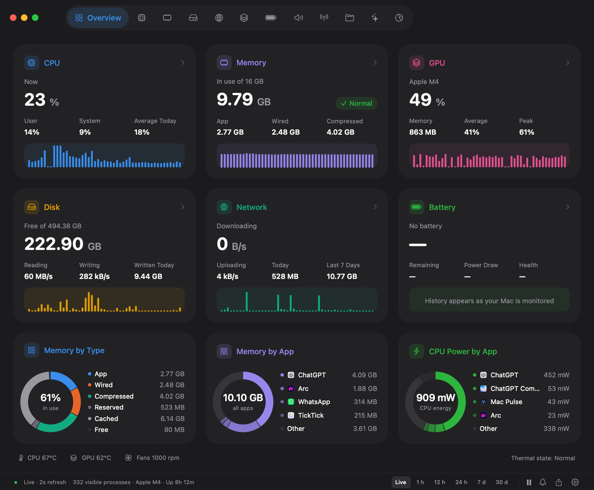

| Tab | What you can see or do |
| --- | --- |
| **Overview** | Six live metric cards, recent charts, memory breakdowns, app memory and app CPU energy. Temperatures, fans and thermal state appear when available. |
| **CPU** | Total, user and system usage, load average, core count, app rankings and individual processes. |
| **Memory** | App, wired, compressed, reserved, cached, free and swap memory, available RAM, pressure and grouped app footprints. |
| **Disk** | Free/used capacity, mounted volumes, physical read/write rates and app writes. |
| **Network** | Download/upload rates, current interface, app traffic and totals observed while monitoring. |
| **GPU** | Driver utilization, graphics memory, app GPU time, recent average and peak. |
| **Battery** | Charge, estimated time, cycles, health, temperature and power draw on supported Macs. |
| **Sound** | Choose an output, adjust supported system volume, see playing/silent status, and adjust or mute each app through Core Audio process taps. |
| **Bluetooth** | Connected/paired devices and reported battery levels, including earbud/case readings when macOS supplies them. |
| **Projects** | Runtimes grouped by working directory, listening ports, observed CPU inactivity and confirmed process termination. |
| **Insights** | Findings from sustained app load, ten-minute memory growth, pressure, low free disk space and available temperature readings. Open a finding to inspect its readings. |
| **Storage growth** | Save folder-size snapshots, compare complete scans and explore a clickable storage map. |
| **Connectivity** | Run DNS, latency, packet-loss and HTTPS checks on demand. |

## Clean up and regain control

Open **Cleanup** or press **⌘⇧K** for the storage and app recovery workspace. Choose a tool, scan, review the results and select the action you want to take.

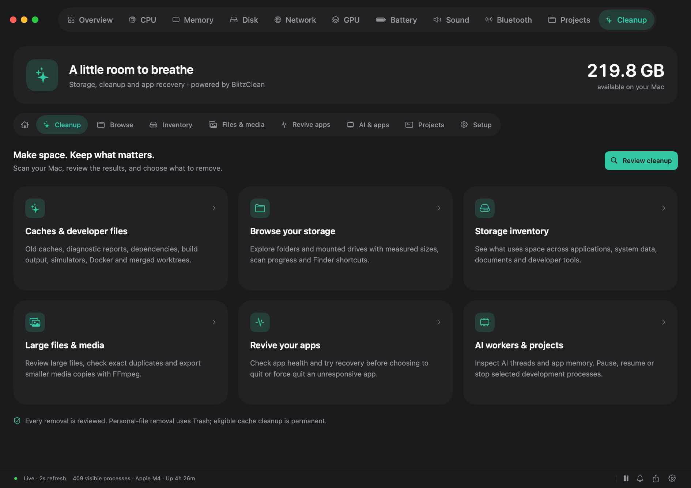

| Tool | What you can see or do |
| --- | --- |
| **Cleanup** | Review old caches/reports, inactive dependencies with an exact reinstall lock, generated builds, simulators, Docker rebuildable storage and merged Git worktrees. |
| **Browse** | Explore folders and mounted drives with measured sizes, scan progress and Finder shortcuts. |
| **Inventory** | Inspect storage, identify caches by their app names/icons, select multiple caches, or review an app and files matched to its bundle ID before moving selected items to Trash. |
| **Files & media** | Review large files, verify exact duplicates and export smaller media copies while keeping originals. Export requires an existing `ffmpeg`/`ffprobe` installation. |
| **Revive apps** | Check app health, try recovery, or choose normal quit and reviewed force quit. |
| **AI & apps** | Inspect supported AI threads and app/process memory. |
| **Projects** | Pause/resume or explicitly stop selected processes, save start commands and optionally enable pressure policies. Pausing a process still holds its RAM. |
| **History** | Read cleanup receipts with exact paths, selected size and measured free-space change; restore tracked items still in Trash. |
| **Setup** | Review optional Full Disk Access/Accessibility permissions and add project folders. |

Opening a tool starts its scan; the landing page does not scan your disk. Removal requires review/confirmation, and the engines recheck file/process identity and activity. Personal-file removal and manually selected Inventory caches use Trash. The Cleanup tool's eligible old caches and developer artifacts are removed permanently after confirmation. Docker containers and volumes are preserved.

In **Inventory → Caches**, tick individual rows or select all caches matching your search. The footer shows the selected count and size. Choose **Move selected to Trash…**, review the exact paths, then confirm. Running apps, open files, links, changed caches and incomplete checks are kept with an explanation. Installed app icons are used where an owner can be identified; unrecognized/tool caches use a neutral icon. Empty Trash later to reclaim space.

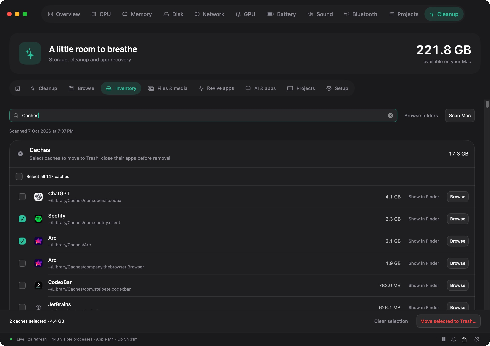

Scans can be incomplete because of permissions, changing volumes or scan budgets; the interface reports those limits. Scanned sizes differ from actual free-space gains. Dashboard image export shows the Cleanup tools overview; individual scan results remain in the interactive views.

## Understand problems and storage growth

**Insights** explains sustained CPU, disk or network activity, ten-minute app memory growth, elevated memory pressure, low disk space and high CPU temperature when a sensor is available. Each finding opens its relevant chart or app. Gaps caused by pause, sleep or missed collection reset sustained observations; an app restart resets its memory baseline. Findings describe measurements, rather than claiming to diagnose their cause. The view also shows Mac Pulse's own CPU and memory usage.

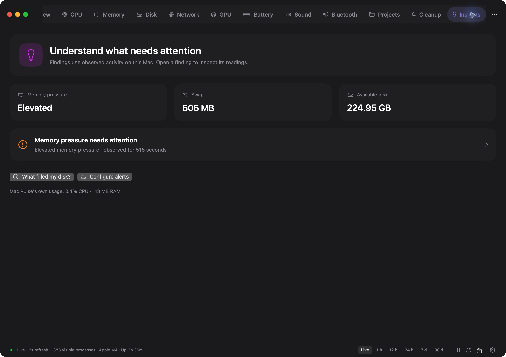

In **Storage growth**, add folders you want to watch and choose **Scan folder** to save a baseline. Scan again later and choose an earlier complete scan to see additions, growth and removals. Click a tile in the storage map to reveal its item in Finder. Scans measure allocated bytes, skip links and other volumes, and stop after 200,000 entries or 30 seconds. Partial scans are labeled and excluded from growth comparisons. Up to 300 snapshots from the last 90 days stay in `~/Library/Application Support/MacMonitor/storage-growth.json`. Scans run only when requested.

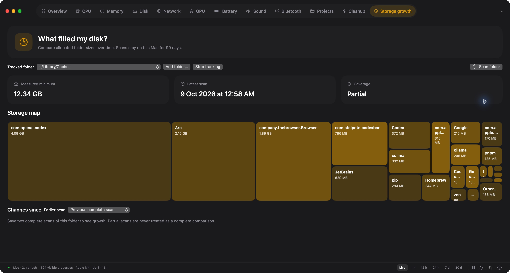

**Settings → Alerts** lets you add, disable or remove rules; choose a metric, threshold, observed duration and optional app. Rules cover CPU, ten-minute memory growth, disk writes, network traffic, disk availability, memory pressure and CPU temperature. CPU thresholds always mean a percentage of the whole Mac; rates use decimal MB/s. Quiet hours suppress system notifications while retaining the in-app alert list. Notifications are optional and repeated rule/app alerts are limited to once every 30 minutes.

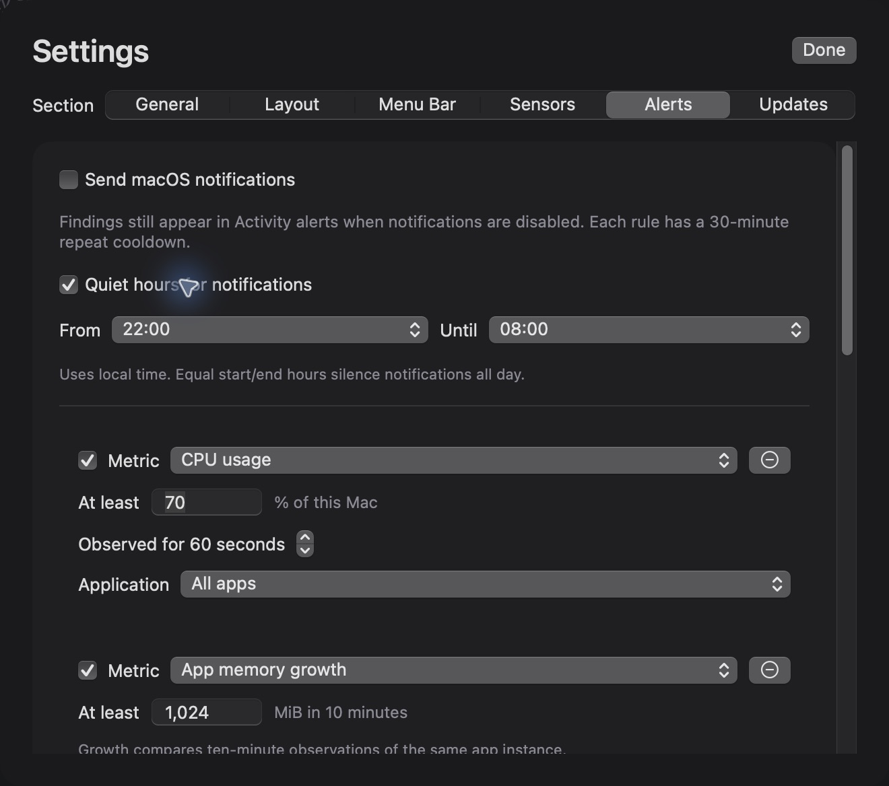

**Connectivity** checks a hostname or IP address using five ICMP probes and a DNS lookup, alongside Apple's HTTPS connectivity endpoint. Results show latency, packet loss, DNS answers and the HTTPS response. Checks run when you click **Run checks** and contact the entered host, your configured DNS resolver and Apple. A blocked ICMP response alone does not establish that the internet is down.

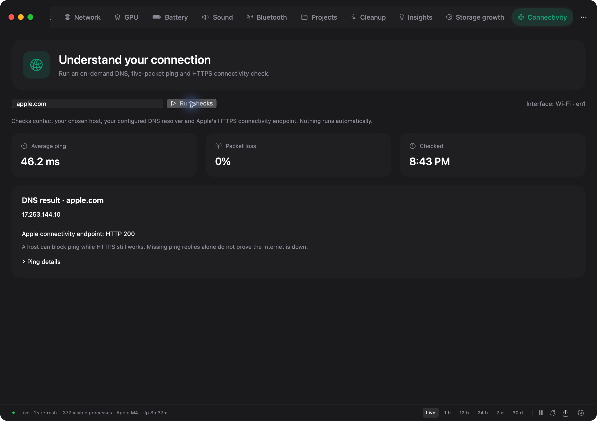

## Review app files and restore cleanup

In **Cleanup → Inventory → Apps**, open an app's **… → Review app and associated files…** menu. Review the app bundle and exact bundle-ID matches in Caches, Preferences, Application Support and Saved Application State. Only the app bundle is selected initially. Support data can contain profiles or personal app data; select it explicitly after review. Shared containers, app groups and ambiguous app-name matches are excluded. Quit the app before removal. Changed files, incomplete measurements and open files block the affected action.

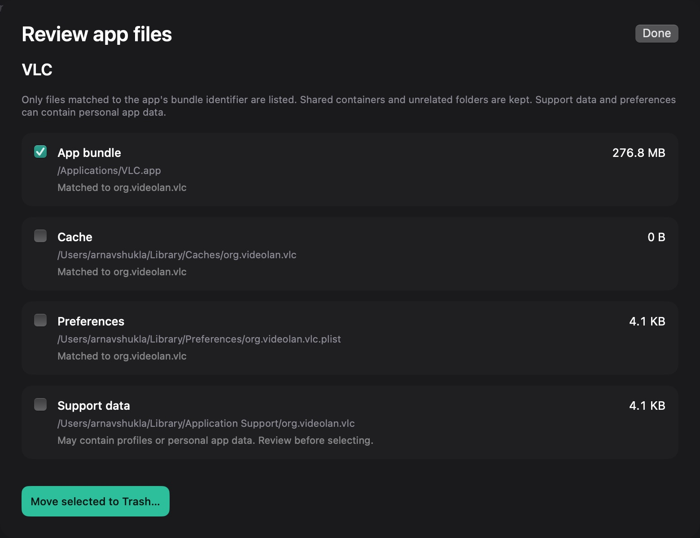

**Cleanup → History** records exact paths, selected size where measured and the observed free-space change. Trash actions from Inventory, Browse and Files & media record restore locations when macOS provides them. Choose **Restore…** to return a tracked item to its original folder. Restore verifies the item's identity and original parent and never overwrites an existing file. Access to protected Trash locations or original folders may require **Full Disk Access**, available through **Cleanup → Setup**; denied access leaves the item in Trash and displays an explanation. Items already emptied from Trash, changed items, permanently removed artifacts and older receipts without tracking cannot be restored. Moving an item to Trash does not immediately reclaim disk space.

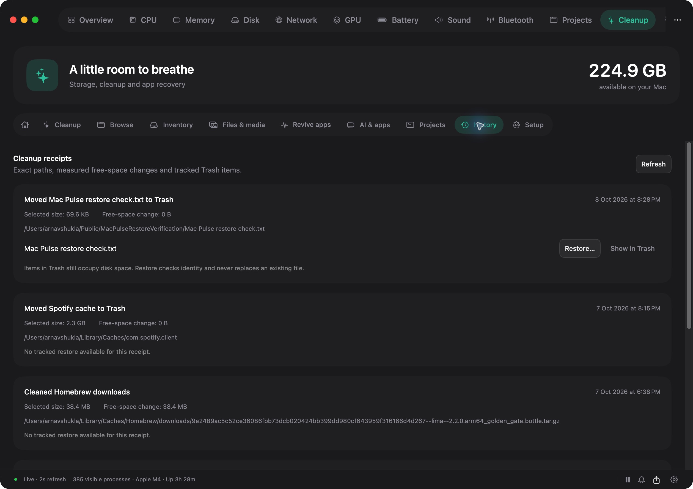

## Keep readings in view

In **Settings → Menu Bar**, enable **Separate movable menu-bar items** for selected metric readouts. Each opens its metric chart; hold **⌘** and drag to move them using macOS menu-bar positioning. The main icon still opens the compact dashboard. Enable **Show floating dashboard** for a small movable panel that stays above other windows and opens metric details with a click. Its position is remembered; close it with its × button.

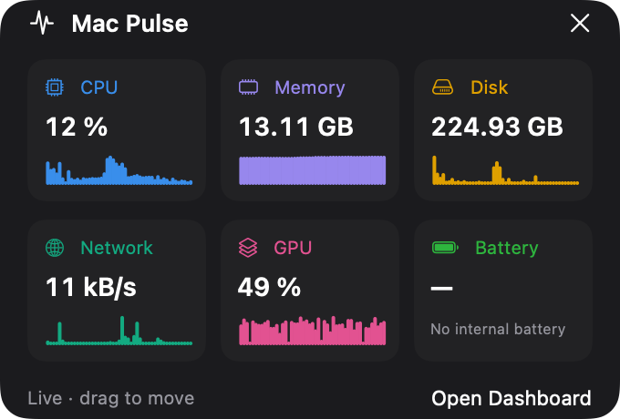

## Download and install

**Requirements:** an Apple Silicon Mac (M1 or later) running **macOS 14.2 or newer**. The published binary is `arm64`. Intel users can try building from source on an Intel Mac; that configuration has not been tested.

1. [Download the DMG](https://github.com/thelordzeus/mac-monitor/releases/latest/download/Mac-Pulse-arm64.dmg) and open it.
2. Drag **Mac Pulse.app** to the **Applications** folder shown in the disk image.
3. Eject the disk image and open **Mac Pulse** from Applications.
4. Click the menu-bar icon for a compact view; click anywhere outside the panel to dismiss it.

**Upgrading from Mac Monitor:** quit the earlier app before opening Mac Pulse. Your existing history, settings and Cleanup state are retained. The GitHub repository is still `thelordzeus/mac-monitor`.

The [ZIP](https://github.com/thelordzeus/mac-monitor/releases/latest/download/Mac-Pulse-arm64.zip) contains the same app. Releases include [SHA256 checksums](https://github.com/thelordzeus/mac-monitor/releases/latest/download/SHA256SUMS); run `shasum -a 256 Mac-Pulse-arm64.dmg` and compare the result with the matching entry.

The downloadable build is signed locally (**ad hoc**) and is **not notarized by Apple**. If macOS blocks the first launch, review the source and download, then approve this specific app in **System Settings → Privacy & Security → Open Anyway**. See [Apple's first-launch instructions](https://support.apple.com/102445).

## Stay up to date

Starting with **1.4.0**, Mac Pulse checks GitHub for updates once a day. When a new release is available, a native dialog shows the release notes and offers **Install**, **Later** and **Skip**. Choose **Mac Pulse → Check for Updates…**, use the menu-bar panel, or open **Settings → Updates** to check manually.

Automatic checks can be disabled. Automatic downloads and installation are off by default; you can opt in from Settings. Updates preserve your monitoring history, preferences and Cleanup state.

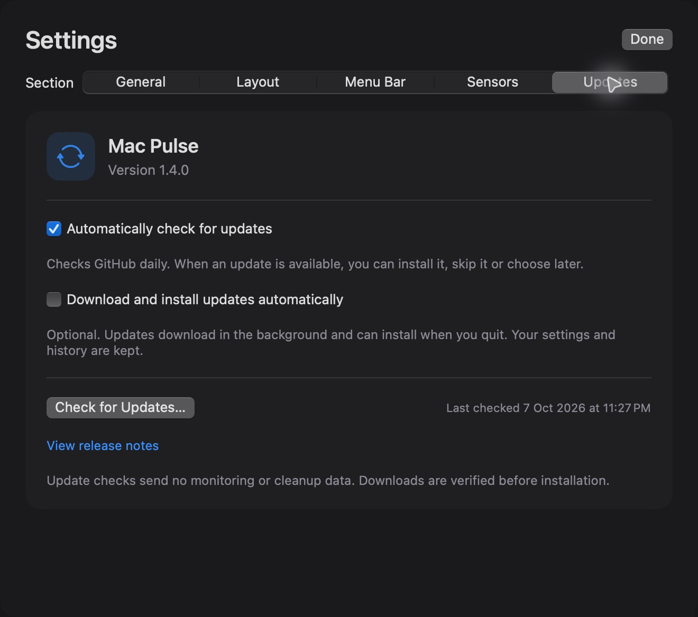

**Already using 1.3.1 or earlier?** Quit the old app, download the latest DMG and replace it in Applications once. Those versions do not include an updater. Later releases can update inside the app.

Updates use [Sparkle](https://sparkle-project.org/) with signed feeds and Ed25519-signed archives hosted on GitHub. Signatures are checked before extraction. No paid Apple Developer membership or user account is needed. Update requests send no system metrics or cleanup data; GitHub receives ordinary network requests for the feed and downloads. The first-install approval described above still applies to this non-notarized app.

## Everyday tools

- **Menu bar:** choose combined or independent movable readouts, open focused metric panels, or enable a floating dashboard. Monitoring continues when you close the main window; use Quit to stop the app.
- **History:** recent live readings plus 1-hour, 12-hour, 24-hour, 7-day and 30-day ranges. App detail sheets include per-app history.
- **Alerts:** configurable thresholds, app selection, observed durations and quiet hours. System notifications are optional.
- **App controls:** search, pin apps, include system processes, inspect processes and confirm graceful or forced termination.
- **Export:** save/copy a dashboard PNG or export app statistics as CSV.
- **Customization:** reorder/hide tabs and overview cards, choose refresh interval, Celsius/Fahrenheit and network bits/bytes, and enable launch at login.
- **Updates:** daily checks, manual checks, signed downloads, release notes and optional automatic installation.

Use the footer's time ranges to inspect saved readings, pause to stop collection, the bell for activity alerts, share for exports and the gear for settings.

| Shortcut | Action |
| --- | --- |
| `⌘1` through `⌘9`, `⌘0` | Switch monitoring tabs in their original order; `⌘0` opens Projects. |
| `⌘⇧K` | Open Cleanup. |
| `⌘,` | Open settings. |
| `⌘⇧P` | Pause/resume monitoring. |
| `⌘⇧E` | Export app statistics. |
| `Esc` | Dismiss the menu-bar panel. |
| `⌘Q` | Quit the app. |

## More screenshots

The images show actual readings from an Apple M4 desktop Mac, with totals from saved local history. The Battery tab reports no internal battery; Bluetooth discovery is shown before access is enabled. Supported readings differ by Mac.

| CPU | Memory |
| --- | --- |
| 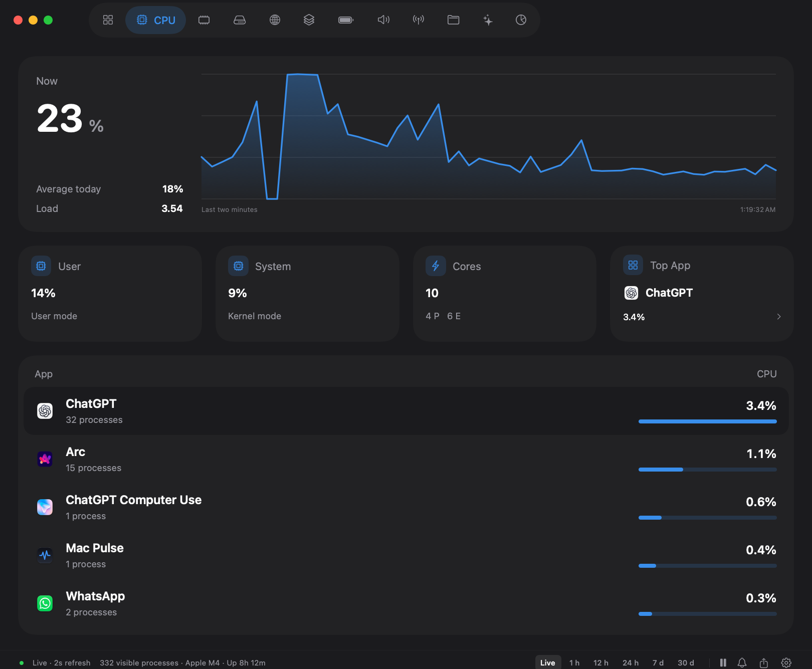 | 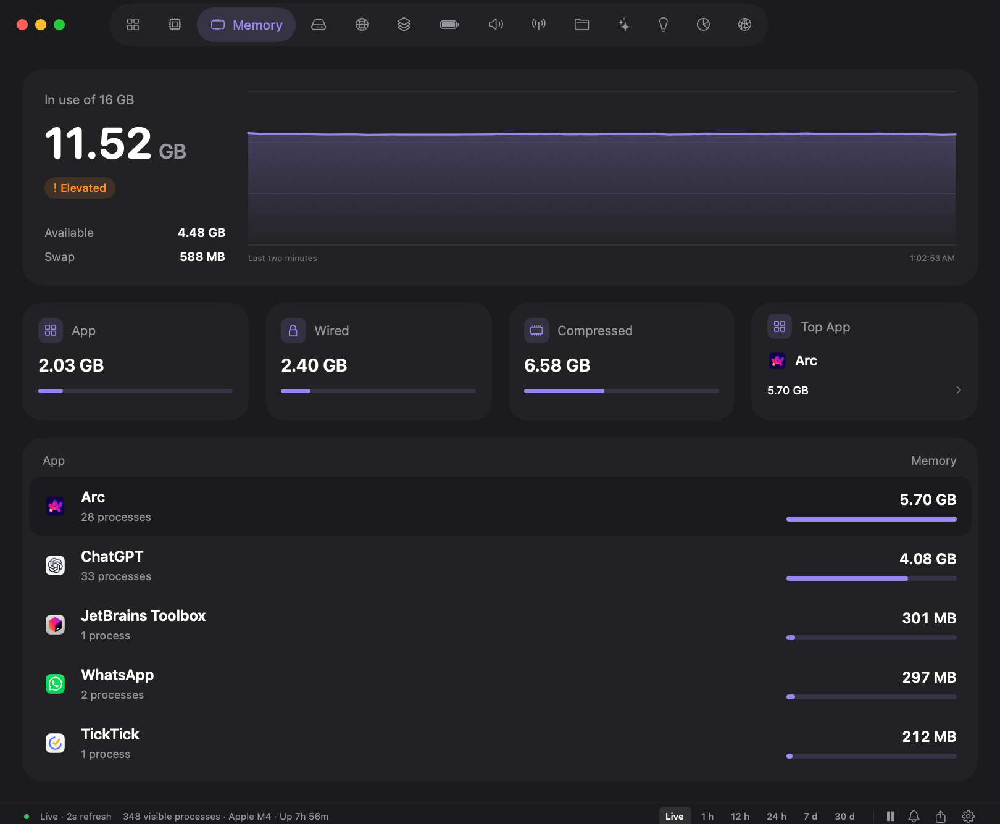 |

### Disk

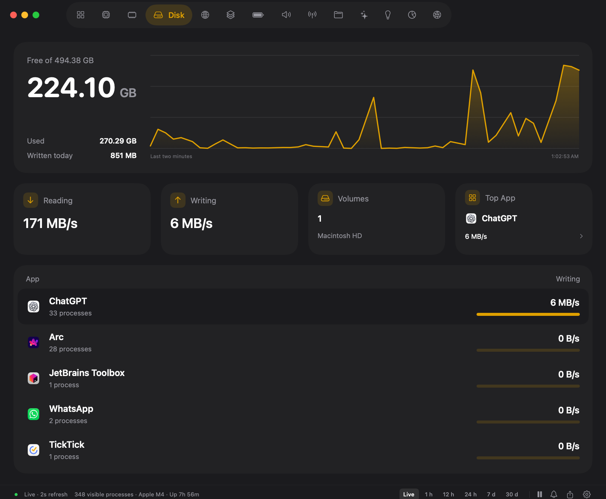

### Network

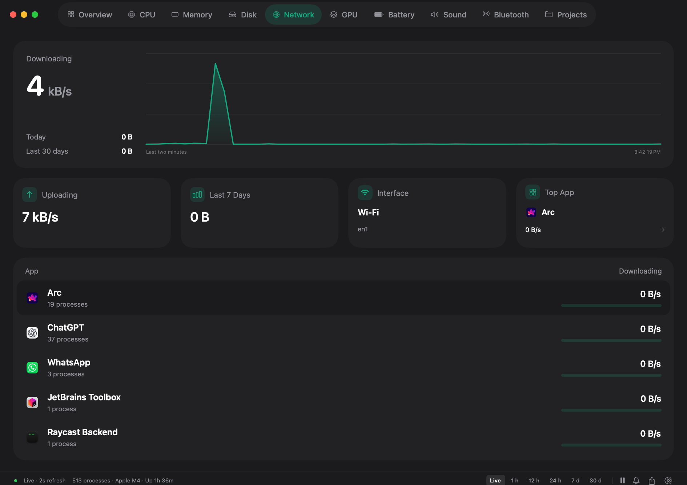

### GPU

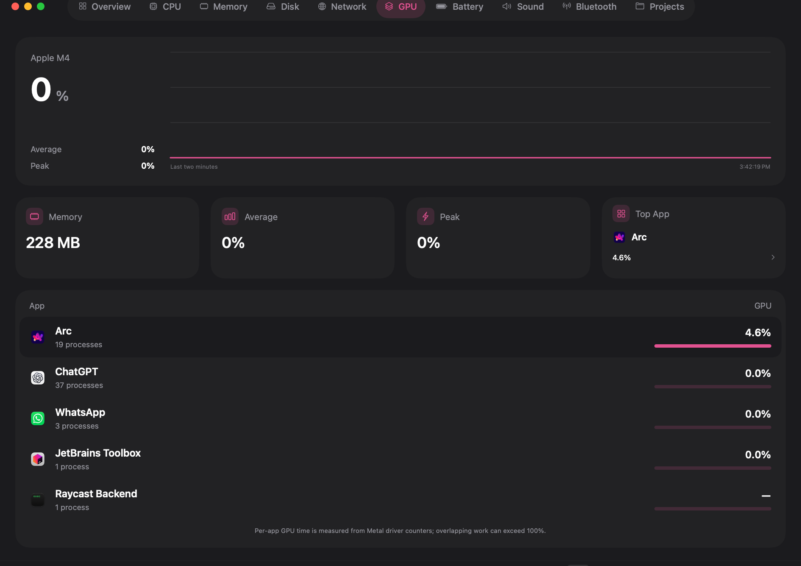

### Battery

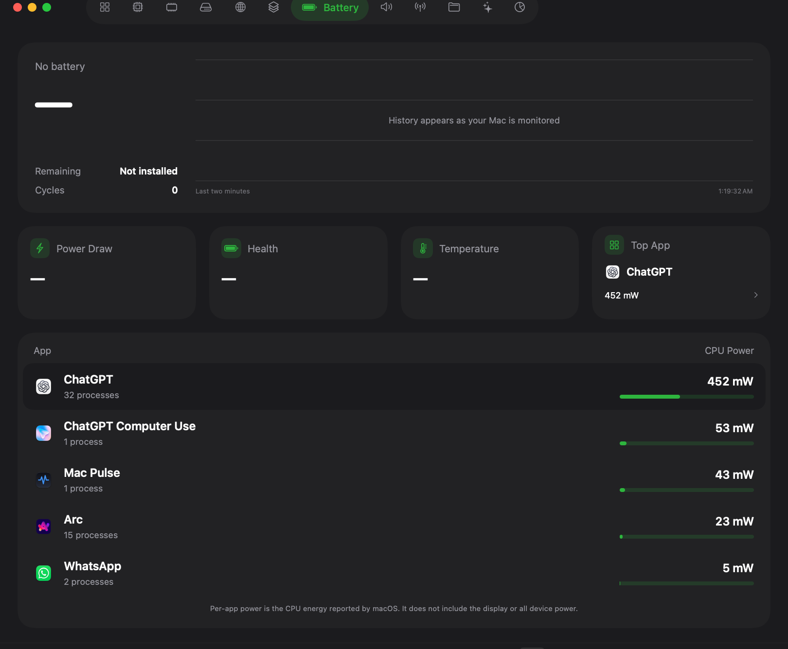

### Sound

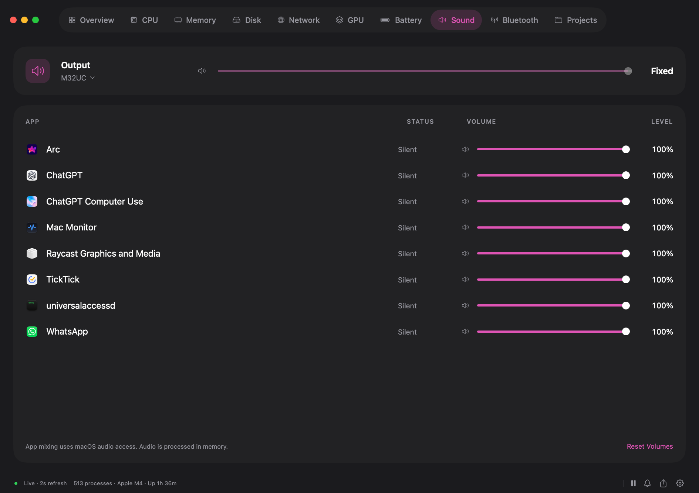

### Bluetooth

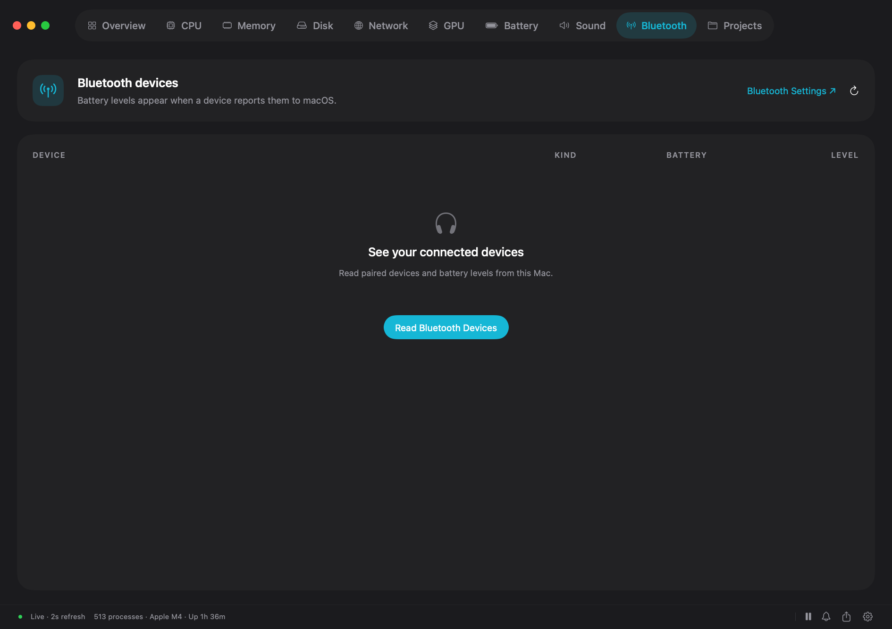

### Projects

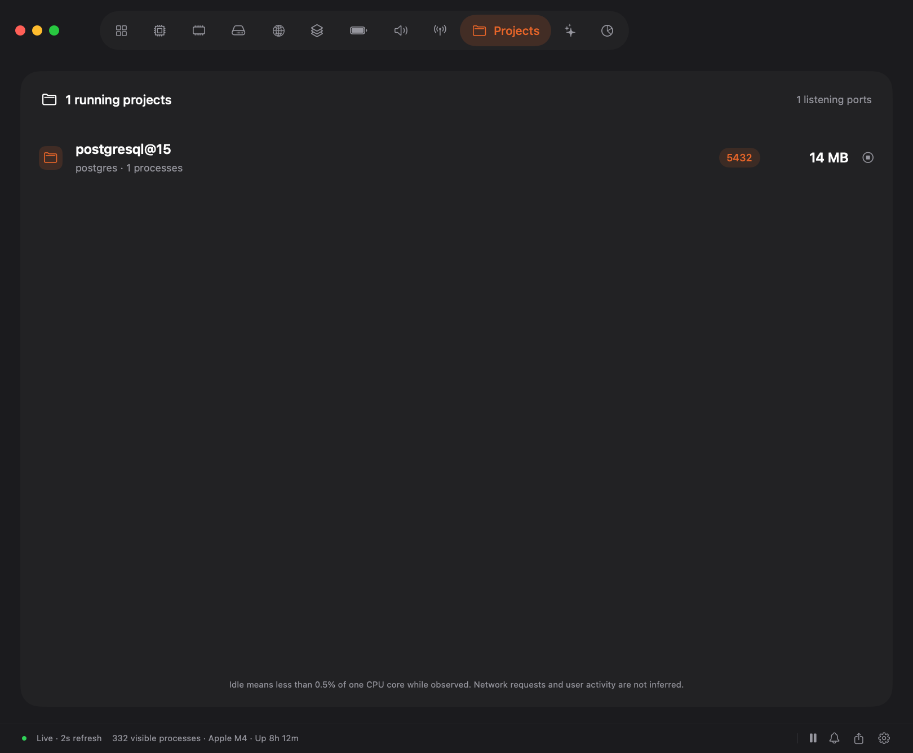

## Optional permissions

- **Per-app audio:** the first app-volume adjustment can request macOS system-audio access. If denied, allow Mac Pulse under **Privacy & Security → Screen & System Audio Recording**, then relaunch. Audio is processed in memory; normal monitoring and supported system-volume controls do not capture audio.
- **Bluetooth:** click **Read Bluetooth Devices** or Refresh to start discovery. Devices that do not report battery levels show **Not reported**.
- **Notifications:** enable them in settings. They are off by default.
- **Launch at login:** enable it in settings. macOS may require approval in Login Items.
- **Cleanup:** optional Full Disk Access includes protected folders in scans; Accessibility enables additional app-health checks. Review both under **Cleanup → Setup**. Ordinary review works with access already available.

Cleanup history and review state stay under `~/Library/Application Support/MacMonitor/Cleanup`. The original data paths are retained through the Mac Pulse rename. No tools or permissions are installed or enabled automatically.

## Build from source

Clone this repository, then run these commands from its root:

```sh
git clone https://github.com/thelordzeus/mac-monitor.git
cd mac-monitor
./scripts/build.sh
./scripts/run.sh
```

The build script compiles a release executable, creates `dist/Mac Pulse.app`, embeds the pinned Sparkle framework, adds the icon and signs the bundle locally. SwiftPM downloads Sparkle on the first build, so that build needs internet access. It uses `/Applications/Xcode.app` when available, otherwise the selected Command Line Tools. SDKs requiring SwiftUI macro plugins, including macOS 27, need **full Xcode**. No paid developer account is needed for this local build. The executable targets the architecture of the machine compiling it.

### Create a DMG and ZIP

```sh
./scripts/package.sh
```

The script builds the app and creates architecture-specific DMG/ZIP files plus `dist/SHA256SUMS`. The DMG includes the app, an Applications shortcut and installation notes. If you already built the current source, use `./scripts/package.sh --skip-build`.

Built artifacts stay in `dist/` and are excluded from Git. Publish the DMG, ZIP and checksums as GitHub Release assets rather than committing binaries.

### Publish an update

After bumping both version/build in `Resources/Info.plist` and writing the matching release notes:

```sh
./scripts/build.sh
./scripts/package.sh --skip-build
./scripts/make-appcast.sh
```

Commit the completed source, notes and generated `appcast.xml`, then push to `main` and run:

```sh
./scripts/publish-release.sh
```

The signing key stays in the releasing Mac's Keychain under account `mac-pulse`. The feed generator verifies that the key matches the public key embedded in the app, preserves older feed entries, signs the feed and archive, and validates their signatures. The publisher requires a clean, pushed commit, verifies the release files, and uploads the DMG, ZIP, checksums and signed feed. It does not overwrite older releases. See [update maintenance and verification](docs/UPDATES.md).

## How readings and history work

Metrics are sampled locally, every two seconds by default. A dash means macOS or the hardware did not supply a reading.

History is stored in `~/Library/Application Support/MacMonitor/history.sqlite`. It saves minute averages, flushes on normal exit and retains 30 days. It starts when you run the app. Periods when monitoring is paused, the Mac is sleeping or the app has quit are not observed. Nothing is uploaded.

- App CPU is normalized across the Mac by default; settings can switch to percentages of one core.
- App memory uses physical footprint when available. Shared memory means summed app footprints can differ from system memory. RAM uses binary units; disk capacity and network traffic use decimal units.
- Memory Used includes system-reserved RAM and excludes free pages and reclaimable cache. Available includes both free RAM and cache. The breakdown keeps these categories separate.
- App GPU time comes from driver counters. Overlapping work can exceed 100%.
- App power is macOS-reported **CPU energy**, rather than whole-system power. Battery watts come from current and voltage; values while on AC can be zero.
- Network totals cover observed periods. System counters use physical `en*` and cellular interfaces. App network counters refresh roughly every ten seconds through `nettop` and can be restricted by macOS.
- Project inactivity reflects observed CPU usage, rather than whether a server handled a request recently.

## Limits

Sensor and device support varies by Mac. Manual fan control and a full localization set are not included. Menu-bar items can be combined or moved independently. Some protected processes cannot be fully inspected or terminated without further privileges.

The build and core statistics/history checks were validated on an Apple M4 Mac. Per-app audio mixing is implemented but has not been tested end to end. Intel Macs and every possible battery/Bluetooth device have not been tested.

## Development checks

```sh
./scripts/test-cleanup.sh
"dist/Mac Pulse.app/Contents/MacOS/MacMonitor" --self-test
"dist/Mac Pulse.app/Contents/MacOS/MacMonitor" --diagnostics
python3 scripts/verify-metrics.py
"dist/Mac Pulse.app/Contents/MacOS/MacMonitor" --render artifacts/screenshots
```

The self-test checks controlled CPU, 256 MiB memory, 8 MiB TCP and 8 MiB disk workloads, PID grouping, stale-PID protection, pause baselines, weighted history, pending totals, unknown readings, app ranking and formatting. The independent Python audit compares live readings with macOS counters and commands, saving a local report to `artifacts/metrics-audit.json` (excluded from Git). See [the verification findings](docs/VERIFICATION.md) for results and limitations. The Swift tests also cover observation gaps/restarts, quiet hours, partial folder scans, storage-map proportions, network parsing, app-file fingerprints and restore conflicts. See [1.5.0 feature verification](docs/FEATURES-VERIFICATION.md) for the test results and native checks. `--render` produces the monitoring screenshots, Cleanup landing page and floating dashboard from real Mac readings; it does not inject simulated statistics.

## Credits

The monitoring interface is inspired by [Vitals](https://vitalsmac.com/). Mac Pulse is an independent implementation with its own name, icon and source code and is not affiliated with Vitals.

Required third-party copyright and license notices are preserved in [ThirdPartyNotices.txt](Resources/ThirdPartyNotices.txt) and included in the app bundle. See [cleanup component details](ThirdParty/Cleanup/README.md) and [cleanup verification](docs/CLEANUP-VERIFICATION.md).

The updater uses [Sparkle 2.10.0](https://github.com/sparkle-project/Sparkle), with its [license and dependency notices](Resources/Sparkle-LICENSE.txt) included in the app.
